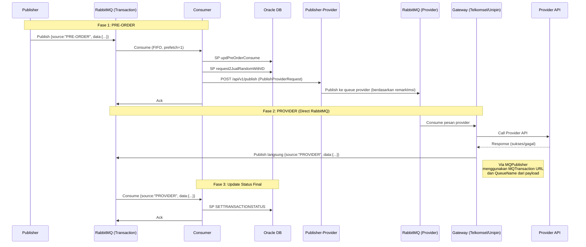
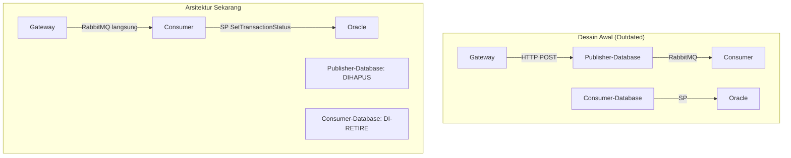

# Dokumen Design: Complete Event-Driven Flow (Updated)

## Overview

Dokumen ini mendeskripsikan arsitektur event-driven FIFO pada Payment Processing System (PPS) setelah semua perubahan diimplementasikan. Arsitektur telah disederhanakan dari desain awal — Publisher-Database dihapus, gateway publish langsung ke RabbitMQ.

### Alur Transaksi End-to-End (Current)



### Perubahan dari Desain Awal



## Architecture

### Komponen dan Status Implementasi

| Service | Komponen | Status |
|---------|----------|--------|
| pps-services-consumer | Source routing (extractSource, processPreOrder, processProvider) | ✅ Implemented |
| pps-services-consumer | HTTP client ke Publisher-Provider (CallPublisherProvider) | ✅ Implemented |
| pps-services-consumer | SP_SetTransactionStatus | ✅ Implemented |
| pps-services-consumer | Parse wrapper format PROVIDER | ✅ Implemented (parseProviderMessage) |
| pps-services-consumer | Backward compat flat format | ✅ Implemented |
| pps-services-gateway-telkomsel | MQPublisher (replace DownstreamClient) | ✅ Implemented |
| pps-services-gateway-telkomsel | Transaction logging Postgres | ✅ Implemented |
| pps-services-gateway-telkomsel | Callback endpoint GET /callback/ext | ✅ Implemented |
| pps-services-gateway-telkomsel | HTTP server + RabbitMQ consumer via errgroup | ✅ Implemented |
| pps-services-gateway-unipin | MQPublisher (replace DownstreamClient) | ✅ Implemented |
| pps-services-gateway-unipin | Voucher list sync to Oracle | ✅ Implemented |
| pps-services-gateway-unipin | unipin-game transaction flow | 📋 Spec ready, not yet executed |
| pps-services-gateway-unipin | unipin-voucher command parsing update | 📋 Spec ready, not yet executed |
| pps-services-consumer-database | Deprecated | ✅ Retired |
| pps-services-publisher-database | Removed from architecture | ✅ Removed |

### Format Pesan RabbitMQ

Semua pesan menggunakan format wrapper:

**PRE-ORDER (Publisher → Consumer):**
```json
{
  "source": "PRE-ORDER",
  "data": {
    "user": "...",
    "produk": "...",
    "mdn": "...",
    "noTrx": "...",
    "signature": "...",
    "addr": "...",
    "serverId": "..."
  }
}
```

**PROVIDER (Gateway → Consumer):**
```json
{
  "source": "PROVIDER",
  "data": {
    "msg_id": 123,
    "status_to_be": "SUCCESS",
    "serial_number": "SN123",
    "client_number": "6281234567890",
    "nominal": "15000",
    "original_conversation_id": "",
    "conversation_id": "TRX123",
    "message_to_customer": "Success",
    "additional_message": "",
    "queue_name": "..."
  }
}
```

### Gateway Downstream: RabbitMQ Direct (bukan HTTP)

Gateway publish langsung ke RabbitMQ menggunakan:
- `MQTransaction` — URL RabbitMQ tujuan (dibawa oleh setiap transaksi dari publisher-provider)
- `QueueName` — nama queue tujuan (dibawa oleh setiap transaksi)
- `MQPublisher.Publish(ctx, mqTransactionURL, queueName, body)` — buka koneksi baru per publish

Tidak ada lagi:
- ~~DownstreamClient~~ (HTTP POST)
- ~~Publisher-Database~~ (perantara)
- ~~Circuit breaker / exponential backoff ke downstream~~ (fire-and-forget, error di-log)

## Specs Terkait

| Spec | Repo | Status |
|------|------|--------|
| telkomsel-transaction-log | gateway-telkomsel | ✅ Executed |
| telkomsel-callback-endpoint | gateway-telkomsel | ✅ Executed |
| rabbitmq-downstream-publisher | gateway-telkomsel | ✅ Executed |
| rabbitmq-downstream-publisher | gateway-unipin | ✅ Executed |
| provider-message-wrapper-format | consumer | ✅ Executed |
| unipin-transaction-flow | gateway-unipin | 📋 Ready to execute |
