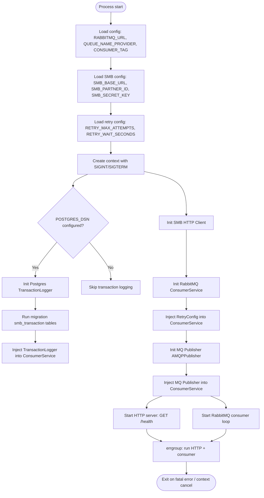
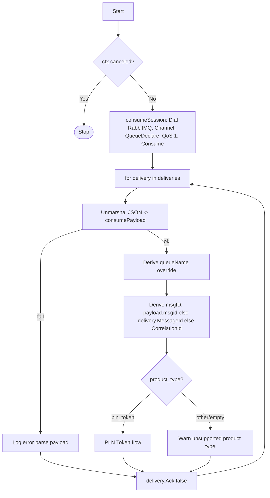
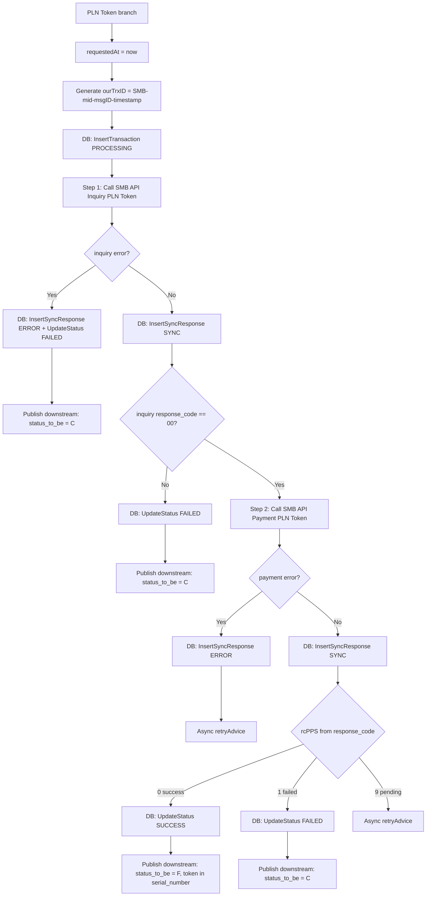
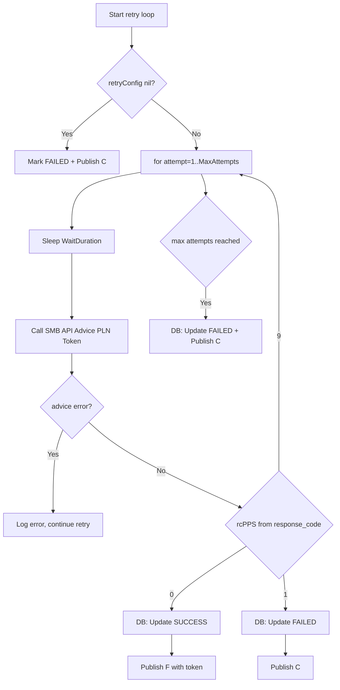

# Flowchart Gateway SMB — PLN Token

Dokumen ini menjelaskan alur `pps-services-gateway-smb` untuk produk PLN Token menggunakan SMB/Loket Bayar API.

## 1) Startup & Komponen



## 2) RabbitMQ Consumer — Top-level Flow



## 3) PLN Token Flow (Inquiry → Payment → Publish Downstream)



## 4) Async Retry — Advice/Check Status



## 5) Downstream Publish Format

Semua publish ke downstream consumer menggunakan format wrapper:

```json
{
  "source": "PROVIDER",
  "data": {
    "msg_id": 123,
    "status_to_be": "F",
    "serial_number": "TOKEN_PLN_12345",
    "client_number": "12345678901",
    "nominal": "50000",
    "conversation_id": "SMB-MID-123-20260422120000",
    "message_to_customer": "Token PLN: TOKEN_PLN_12345",
    "queue_name": "queue_smb_pln_token"
  }
}
```

## 6) Impact ke pps-services-tokopedia

Tokopedia **tidak perlu perubahan kode** untuk mendukung SMB gateway. Alur:

1. Tokopedia menerima payment request dari user
2. Tokopedia publish ke RabbitMQ (format legacy `PRE_ORDER||...`)
3. Consumer (pps-services-consumer) consume dan proses PRE-ORDER
4. Consumer call Publisher-Provider
5. Publisher-Provider route ke queue SMB berdasarkan `remarkImsi`
6. **Gateway SMB** consume dari queue provider, call SMB API, publish result
7. Consumer consume result `{source: "PROVIDER", data: {...}}`
8. Consumer call SP_SetTransactionStatus di Oracle

Yang perlu dikonfigurasi:
- Publisher-Provider: tambah routing rule untuk produk PLN Token ke queue SMB
- Environment: set `QUEUE_NAME_PROVIDER` di gateway SMB sesuai queue yang di-route

## SMB API Response Code Mapping

| SMB Code | Deskripsi | RC PPS | status_to_be |
|----------|-----------|--------|--------------|
| 00 | Success | 0 | F |
| 28 | Timeout/Pending | 9 | S (retry advice) |
| 68 | Timeout/Pending | 9 | S (retry advice) |
| empty | Unknown | 9 | S (retry advice) |
| lainnya | Failed | 1 | C |
