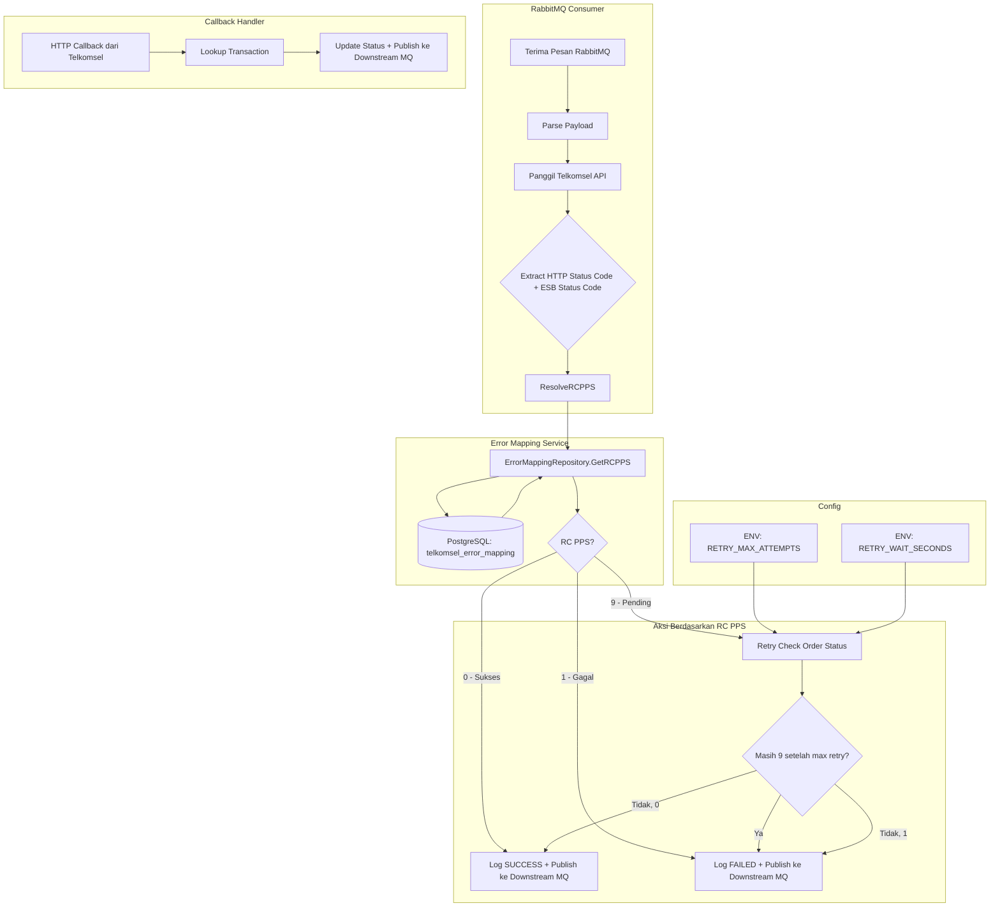

# Dokumen Desain: Error Mapping

## Overview

Fitur Error Mapping menggantikan logika hardcoded `StatusCode == "00000"` di consumer flow dengan mekanisme lookup terpusat berbasis database. Sistem menerima kombinasi HTTP Status Code dan ESB Status Code dari respons Telkomsel API, lalu mengembalikan kode RC PPS (0 = sukses, 1 = gagal, 9 = pending) yang menentukan aksi selanjutnya.

Komponen utama:
- **Tabel PostgreSQL `telkomsel_error_mapping`** — menyimpan data mapping yang bisa diubah tanpa deploy ulang
- **ErrorMappingRepository** — interface + implementasi PostgreSQL untuk lookup mapping
- **ResolveRCPPS helper** — fungsi yang dipanggil dari consumer flow dan callback handler
- **Retry check status** — mekanisme retry saat RC PPS bernilai 9 (pending), dikonfigurasi via environment variable
- **RetryConfig** — konfigurasi `RETRY_MAX_ATTEMPTS` dan `RETRY_WAIT_SECONDS` dari environment

### Keputusan Desain Utama

1. **Reuse `*sql.DB` dari `PostgresTransactionLogger`** — Tidak membuat connection pool baru. `ErrorMappingRepositoryImpl` menerima `*sql.DB` yang sama melalui method `DB()` yang ditambahkan ke `PostgresTransactionLogger`.

2. **Default RC PPS = 9** — Jika mapping tidak ditemukan atau terjadi error database, sistem mengembalikan 9 (pending) sebagai fail-safe. Ini memastikan transaksi tidak langsung dianggap gagal tanpa verifikasi.

3. **ResolveRCPPS sebagai method di package-level** — Fungsi helper ditempatkan di `pkg/telkomsel` agar mudah dipanggil dari consumer flow tanpa mengubah signature fungsi yang sudah ada secara drastis.

4. **Retry dilakukan secara synchronous dalam goroutine consumer** — Retry check status untuk RC PPS = 9 dilakukan dalam loop dengan `time.Sleep`, bukan goroutine terpisah, agar lifecycle terikat pada context consumer.

## Architecture



### Alur Ekstraksi HTTP Status Code dan ESB Status Code

Saat consumer memanggil Telkomsel API melalui `Client`, error yang dikembalikan sudah mengandung informasi yang dibutuhkan:

- **`TechnicalError.StatusCode`** → HTTP Status Code (int)
- **`BusinessError.Code`** → ESB Status Code (string)
- **Respons sukses (error == nil)** → HTTP 200, ESB Status Code dari `resp.Transaction.StatusCode`

Fungsi `ResolveRCPPS` akan meng-extract kedua nilai ini dari error/response, lalu melakukan lookup ke database.

## Components and Interfaces

### 1. ErrorMappingRepository Interface

**Lokasi:** `internal/domain/contract/service/error_mapping_repository.go`

```go
package service

import "context"

// ErrorMappingRepository mendefinisikan kontrak untuk akses data error mapping.
type ErrorMappingRepository interface {
    // GetResponseCode mengembalikan nilai RC PPS berdasarkan kombinasi httpStatusCode dan esbStatusCode.
    // Mengembalikan 9 jika mapping tidak ditemukan.
    GetResponseCode(ctx context.Context, httpStatusCode int, esbStatusCode string) (int, error)
}
```

### 2. ErrorMappingRepositoryImpl

**Lokasi:** `internal/infrastructure/postgres/error_mapping_repository.go`

```go
package postgres

// ErrorMappingRepositoryImpl mengimplementasikan ErrorMappingRepository menggunakan PostgreSQL.
type ErrorMappingRepositoryImpl struct {
    db     *sql.DB
    logger contractsvc.Logger
}

// NewErrorMappingRepositoryImpl membuat instance baru.
// Menerima *sql.DB yang sama dari PostgresTransactionLogger.
func NewErrorMappingRepositoryImpl(db *sql.DB, logger contractsvc.Logger) *ErrorMappingRepositoryImpl

// GetResponseCode melakukan SELECT ke telkomsel_error_mapping.
// Mengembalikan rc_pps jika ditemukan, atau 9 jika tidak ditemukan / error.
func (r *ErrorMappingRepositoryImpl) GetResponseCode(ctx context.Context, httpStatusCode int, esbStatusCode string) (int, error)
```

### 3. PostgresTransactionLogger — Tambahan Method DB()

**Lokasi:** `internal/infrastructure/postgres/transaction_logger.go`

```go
// DB mengembalikan *sql.DB yang digunakan oleh PostgresTransactionLogger.
// Digunakan untuk sharing connection pool dengan ErrorMappingRepositoryImpl.
func (l *PostgresTransactionLogger) DB() *sql.DB {
    return l.db
}
```

### 4. ResolveRCPPS Helper Function

**Lokasi:** `pkg/telkomsel/error_mapping.go`

```go
package telkomsel

import "context"

// ErrorMappingResolver adalah interface untuk lookup RC PPS.
type ErrorMappingResolver interface {
    GetResponseCode(ctx context.Context, httpStatusCode int, esbStatusCode string) (int, error)
}

// errorMappingResolver adalah package-level variable yang di-set saat startup.
var errorMappingResolver ErrorMappingResolver

// SetErrorMappingResolver menyuntikkan resolver saat aplikasi startup.
func SetErrorMappingResolver(r ErrorMappingResolver)

// ResolveRCPPS menentukan RC PPS dari HTTP Status Code dan ESB Status Code.
// Mengembalikan 9 jika resolver belum di-set atau terjadi error.
func ResolveRCPPS(ctx context.Context, httpStatusCode int, esbStatusCode string) int
```

### 5. RetryConfig

**Lokasi:** `internal/config/config.go`

```go
// RetryConfig menyimpan konfigurasi retry check status.
type RetryConfig struct {
    MaxAttempts  int
    WaitDuration time.Duration
}

// LoadRetryConfig membaca RETRY_MAX_ATTEMPTS dan RETRY_WAIT_SECONDS dari environment.
func LoadRetryConfig() (*RetryConfig, error)
```

### 6. Perubahan pada ConsumerServiceImpl

**Lokasi:** `internal/infrastructure/rabbitmq/consumer_service.go`

Perubahan utama:
- Tambah field `retryConfig *config.RetryConfig`
- Tambah method `SetRetryConfig(cfg *config.RetryConfig)`
- Ganti logika hardcoded `StatusCode == "00000"` dengan `telkomsel.ResolveRCPPS()`
- Tambah method `retryCheckStatus()` untuk handle RC PPS = 9

### 7. Perubahan pada CallbackHandler

**Lokasi:** `internal/handler/callback_handler.go`

Callback dari Telkomsel membawa field `status` (SUCCESS/FAILED). Logika existing sudah menangani ini dengan benar. Tidak perlu perubahan signifikan pada callback handler karena callback sudah membawa status final dari Telkomsel.

### 8. Perubahan pada main.go

**Lokasi:** `cmd/app/main.go`

- Load `RetryConfig` via `config.LoadRetryConfig()`
- Buat `ErrorMappingRepositoryImpl` menggunakan `pgLogger.DB()`
- Panggil `telkomsel.SetErrorMappingResolver(errorMappingRepo)`
- Set retry config ke consumer via `consumer.SetRetryConfig(retryConfig)`

## Data Models

### Tabel: `telkomsel_error_mapping`

| Kolom | Tipe | Constraint | Deskripsi |
|---|---|---|---|
| `id` | `SERIAL` | PRIMARY KEY | Auto-increment ID |
| `http_status_code` | `INTEGER` | NOT NULL | HTTP Status Code dari respons Telkomsel |
| `esb_status_code` | `VARCHAR(20)` | NOT NULL | ESB Status Code dari body respons |
| `rc_pps` | `INTEGER` | NOT NULL, CHECK (rc_pps IN (0, 1, 9)) | Kode RC PPS hasil mapping |
| `description` | `VARCHAR(255)` | | Deskripsi mapping |
| `created_at` | `TIMESTAMPTZ` | DEFAULT NOW() | Waktu pembuatan record |
| `updated_at` | `TIMESTAMPTZ` | DEFAULT NOW() | Waktu update terakhir |

**Unique Constraint:** `UNIQUE (http_status_code, esb_status_code)`

### Seed Data

| http_status_code | esb_status_code | rc_pps | description |
|---|---|---|---|
| 200 | 00000 | 0 | Success |
| 400 | 20001 | 1 | No eligible offer / Could not get eligible denomination |
| 400 | 20002 | 1 | Invalid mandatory parameter / Invalid MSISDN |
| 400 | 20003 | 1 | Insufficient Balance |
| 400 | 20004 | 1 | Invalid Organization Code / Invalid Product ID |
| 400 | 20005 | 1 | Invalid stock type / Activated member is not eligible |
| 500 | 40000 | 9 | ESB internal error |
| 503 | 10001 | 9 | Service provider unreachable |
| 503 | 10002 | 9 | System under maintenance |
| 400 | 10003 | 1 | Subscriber location does not match with dealer |
| 400 | 10004 | 1 | Subscriber location not found |

### File Migrasi

**`database/migrations/003_create_telkomsel_error_mapping.up.sql`:**
- `CREATE TABLE IF NOT EXISTS telkomsel_error_mapping` dengan schema di atas
- `INSERT ... ON CONFLICT DO NOTHING` untuk 11 baris seed data

**`database/migrations/003_create_telkomsel_error_mapping.down.sql`:**
- `DROP TABLE IF EXISTS telkomsel_error_mapping`

### RetryConfig Model

```go
type RetryConfig struct {
    MaxAttempts  int           // default: 4, dari ENV RETRY_MAX_ATTEMPTS
    WaitDuration time.Duration // default: 10s, dari ENV RETRY_WAIT_SECONDS
}
```

### Alur Ekstraksi Error dari Telkomsel Client

Saat consumer memanggil API Telkomsel, respons dikembalikan dalam bentuk:

1. **Sukses (error == nil, resp != nil):**
   - `httpStatusCode = 200`
   - `esbStatusCode = resp.Transaction.StatusCode` (misal "00000")

2. **BusinessError:**
   - `httpStatusCode` di-extract dari HTTP response (tersedia di context client, perlu di-propagate)
   - `esbStatusCode = businessErr.Code`

3. **TechnicalError:**
   - `httpStatusCode = technicalErr.StatusCode`
   - `esbStatusCode = ""` (tidak ada ESB status code pada technical error)

Karena saat ini `Client` mengembalikan `BusinessError` tanpa HTTP status code, perlu penyesuaian kecil: consumer akan menggunakan HTTP status code 400 sebagai default untuk `BusinessError` (karena Telkomsel mengembalikan business error pada HTTP 4xx), dan `TechnicalError.StatusCode` untuk technical error.

## Correctness Properties

*Correctness property adalah karakteristik atau perilaku yang harus berlaku di semua eksekusi valid dari sebuah sistem — pada dasarnya, pernyataan formal tentang apa yang seharusnya dilakukan sistem. Property menjembatani antara spesifikasi yang bisa dibaca manusia dan jaminan kebenaran yang bisa diverifikasi mesin.*

### Property 1: Round-trip lookup seed data

*For any* baris seed data di tabel `telkomsel_error_mapping`, lookup menggunakan `GetResponseCode(ctx, http_status_code, esb_status_code)` harus mengembalikan nilai `rc_pps` yang sama persis dengan data seed yang di-insert.

**Validates: Requirements 3.1, 7.1**

### Property 2: Default RC PPS untuk kombinasi tidak dikenal

*For any* kombinasi `httpStatusCode` (integer) dan `esbStatusCode` (string) yang TIDAK ada di tabel `telkomsel_error_mapping`, `GetResponseCode` harus mengembalikan nilai default 9.

**Validates: Requirements 3.2, 4.5**

### Property 3: Invariant output RC PPS

*For any* kombinasi `httpStatusCode` (integer apapun) dan `esbStatusCode` (string apapun), hasil `GetResponseCode` harus selalu bernilai 0, 1, atau 9 — tidak pernah nilai lain.

**Validates: Requirements 7.2**

### Property 4: Retry check status berhenti pada RC PPS definitif

*For any* sequence hasil RC PPS dari retry check status, jika salah satu hasil bernilai 0 atau 1 sebelum mencapai `MaxAttempts`, maka retry harus berhenti pada titik tersebut. Jika semua hasil bernilai 9 sampai `MaxAttempts` tercapai, transaksi harus diproses sebagai gagal.

**Validates: Requirements 6.4, 6.5**

### Property 5: Parsing konfigurasi retry valid

*For any* integer positif yang di-set sebagai environment variable `RETRY_MAX_ATTEMPTS` dan `RETRY_WAIT_SECONDS`, `LoadRetryConfig()` harus mengembalikan `RetryConfig` dengan `MaxAttempts` sama dengan nilai `RETRY_MAX_ATTEMPTS` dan `WaitDuration` sama dengan `RETRY_WAIT_SECONDS` detik.

**Validates: Requirements 8.1, 8.2**

### Property 6: Penolakan konfigurasi retry invalid

*For any* string yang bukan integer positif (termasuk string kosong non-default, nol, negatif, non-numerik) yang di-set sebagai `RETRY_MAX_ATTEMPTS` atau `RETRY_WAIT_SECONDS`, `LoadRetryConfig()` harus mengembalikan error.

**Validates: Requirements 8.3, 8.4**

## Error Handling

### 1. Database Error saat Lookup

- Jika `GetResponseCode` gagal karena error koneksi database, mengembalikan default RC PPS = 9
- Error di-log menggunakan `Logger.Error()` dengan context msg_id
- Consumer flow tetap berjalan (non-blocking)

### 2. Resolver Belum Di-set

- Jika `SetErrorMappingResolver` belum dipanggil saat startup, `ResolveRCPPS` mengembalikan default 9
- Log warning bahwa resolver belum diinisialisasi

### 3. Error saat Retry Check Status

- Jika `CheckOrderStatus` API call gagal (network error, timeout), dianggap sebagai RC PPS = 9 dan retry dilanjutkan
- Setiap error di-log dengan detail attempt number dan error message
- Setelah max retry tercapai, transaksi diproses sebagai FAILED

### 4. Invalid Environment Variable

- `LoadRetryConfig()` mengembalikan error jika `RETRY_MAX_ATTEMPTS` atau `RETRY_WAIT_SECONDS` bukan integer positif
- Aplikasi gagal start (fail-fast) jika konfigurasi invalid
- Jika environment variable tidak di-set, menggunakan default (4 attempts, 10 detik)

### 5. Error pada Migrasi

- Migrasi menggunakan `CREATE TABLE IF NOT EXISTS` dan `INSERT ... ON CONFLICT DO NOTHING` untuk idempotence
- Jika migrasi gagal, aplikasi gagal start dengan error message yang jelas

## Testing Strategy

### Property-Based Testing

Library: **`pgregory.net/rapid`** (sudah ada di `go.mod`)

Setiap property test dikonfigurasi dengan minimum 100 iterasi. Setiap test di-tag dengan referensi ke property di design document.

| Property | Test File | Deskripsi |
|---|---|---|
| Property 1 | `internal/infrastructure/postgres/error_mapping_repository_test.go` | Round-trip seed data lookup |
| Property 2 | `internal/infrastructure/postgres/error_mapping_repository_test.go` | Default 9 untuk kombinasi tidak dikenal |
| Property 3 | `internal/infrastructure/postgres/error_mapping_repository_test.go` | Invariant output ∈ {0, 1, 9} |
| Property 4 | `internal/infrastructure/rabbitmq/consumer_retry_test.go` | Retry berhenti pada RC PPS definitif |
| Property 5 | `internal/config/config_test.go` | Parsing konfigurasi retry valid |
| Property 6 | `internal/config/config_test.go` | Penolakan konfigurasi retry invalid |

Tag format: `Feature: error-mapping, Property {number}: {property_text}`

### Unit Tests (Example-Based)

| Test | Deskripsi | Validates |
|---|---|---|
| `TestResolveRCPPS_Success` | HTTP 200 + ESB "00000" → RC PPS 0 | Req 4.2 |
| `TestResolveRCPPS_BusinessError` | HTTP 400 + ESB "20001" → RC PPS 1 | Req 4.3 |
| `TestResolveRCPPS_TechnicalError` | HTTP 500 + ESB "40000" → RC PPS 9 | Req 4.4 |
| `TestResolveRCPPS_ResolverNotSet` | Resolver nil → RC PPS 9 | Req 4.5 |
| `TestGetResponseCode_DBError` | Mock DB error → RC PPS 9 + log error | Req 3.3 |
| `TestConsumerFlow_CallsResolveRCPPS` | Verifikasi consumer memanggil ResolveRCPPS | Req 6.1 |
| `TestConsumerFlow_RCPPS0_Success` | RC PPS 0 → log SUCCESS + publish | Req 6.2 |
| `TestConsumerFlow_RCPPS1_Failed` | RC PPS 1 → log FAILED, no retry | Req 6.3 |
| `TestRetryConfig_Defaults` | Env kosong → MaxAttempts=4, Wait=10s | Req 8.1, 8.2 |

### Integration Tests

| Test | Deskripsi | Validates |
|---|---|---|
| `TestMigration_Idempotent` | Jalankan migrasi 2x tanpa error | Req 1.4 |
| `TestMigration_SeedData` | Verifikasi 11 baris seed setelah migrasi | Req 1.5, 5.3 |
| `TestMigration_UniqueConstraint` | Insert duplikat ditolak | Req 1.2 |
| `TestMigration_CheckConstraint` | Insert rc_pps invalid ditolak | Req 1.3 |
| `TestMigration_Down` | Rollback menghapus tabel | Req 5.4 |

