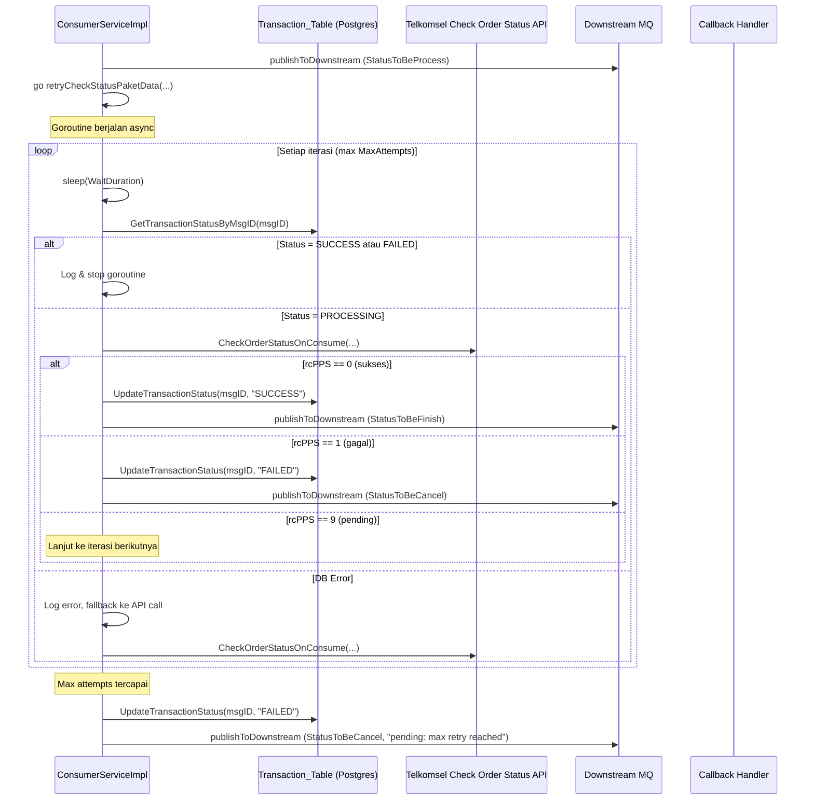
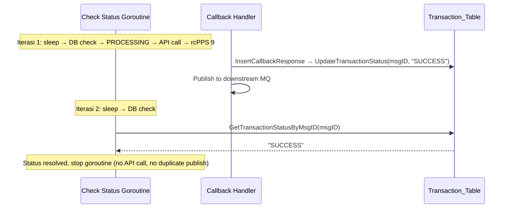
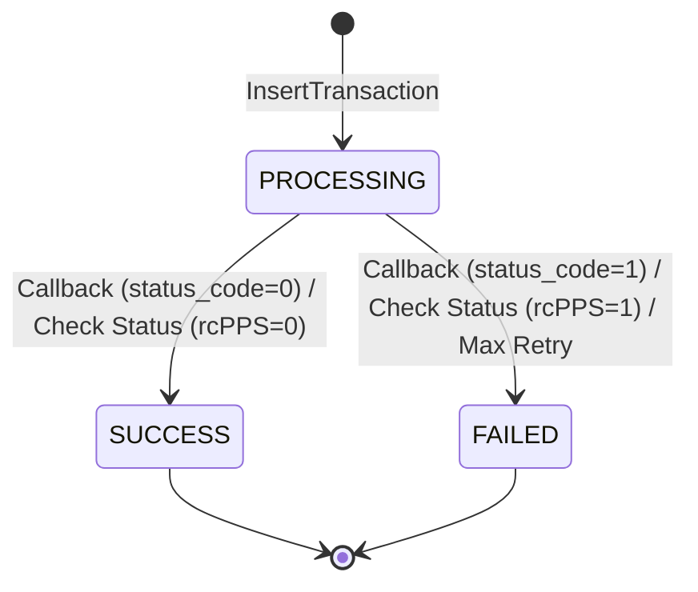

# Design Document: Paket Data Post-Publish Check Status

## Overview

Fitur ini menambahkan goroutine check status baru khusus untuk flow "paket data" di `ConsumerServiceImpl`. Goroutine ini digunakan setelah OrderDealer berhasil (rcPPS == 0) maupun saat status pending (rcPPS == 9). Berbeda dengan `retryCheckStatus`/`retryCheckStatusSync` yang digunakan oleh flow pulsa, goroutine baru ini mengecek status transaksi di database (Transaction_Table) terlebih dahulu sebelum memanggil Telkomsel Check Order Status API. Jika callback sudah menyelesaikan transaksi (status berubah ke SUCCESS atau FAILED), goroutine berhenti tanpa melakukan API call yang tidak perlu.

### Keputusan Desain Utama

1. **Goroutine terpisah dari `retryCheckStatus`**: Flow pulsa tetap menggunakan `retryCheckStatus`/`retryCheckStatusSync` tanpa perubahan. Goroutine baru dibuat khusus untuk paket data agar tidak mempengaruhi flow yang sudah berjalan.
2. **DB check sebelum API call**: Setiap iterasi mengecek status di Transaction_Table. Karena callback handler (`InsertCallbackResponse`) sudah memperbarui status transaksi via `UpdateTransactionStatus`, pengecekan DB ini secara efektif mendeteksi apakah callback sudah tiba.
3. **Satu function untuk rcPPS == 0 dan rcPPS == 9**: Kedua kondisi menggunakan goroutine yang sama untuk konsistensi logic.

## Architecture

### Sequence Diagram: Paket Data Post-Publish Check Status (rcPPS == 0)



### Sequence Diagram: Callback Resolves Transaction During Goroutine



## Components and Interfaces

### 1. TransactionLogger Interface — Method Baru

Tambahkan method `GetTransactionStatusByMsgID` ke interface `TransactionLogger`:

```go
// GetTransactionStatusByMsgID mengambil nilai kolom status dari telkomsel_transaction berdasarkan msg_id.
// Mengembalikan status string ("PROCESSING", "SUCCESS", "FAILED") dan nil error jika ditemukan.
// Mengembalikan error jika msg_id tidak ditemukan atau terjadi error database.
GetTransactionStatusByMsgID(ctx context.Context, msgID string) (string, error)
```

**File**: `internal/domain/contract/service/transaction_logger.go`

### 2. PostgresTransactionLogger — Implementasi Method Baru

Implementasi `GetTransactionStatusByMsgID` menggunakan query sederhana:

```sql
SELECT status FROM transaction.telkomsel_transaction WHERE msg_id = $1 LIMIT 1
```

Menggunakan `sql.ErrNoRows` untuk mendeteksi data tidak ditemukan.

**File**: `internal/infrastructure/postgres/transaction_logger.go`

### 3. PostgresTransactionLogger — Update `UpdateTransactionStatus`

Tambahkan dukungan status "PROCESSING" pada `UpdateTransactionStatus`. Saat ini hanya mendukung "SUCCESS" dan "FAILED". Tambahkan case baru:

```sql
UPDATE transaction.telkomsel_transaction
SET status = 'PROCESSING', updated_at = NOW()
WHERE msg_id = $1
```

**File**: `internal/infrastructure/postgres/transaction_logger.go`

### 4. ConsumerServiceImpl — Goroutine Baru `retryCheckStatusPaketData`

Method baru yang meluncurkan goroutine async:

```go
func (s *ConsumerServiceImpl) retryCheckStatusPaketData(
    ctx context.Context,
    payload consumePayload,
    msgID string,
    queueName string,
    requestedAt time.Time,
    originalTransactionID string,
    serialNumber string,
)
```

Method ini:
- Log info bahwa goroutine dimulai
- Meluncurkan `go s.retryCheckStatusPaketDataSync(...)` dengan `context.Background()`

### 5. ConsumerServiceImpl — `retryCheckStatusPaketDataSync`

Method synchronous yang berisi loop retry:

```go
func (s *ConsumerServiceImpl) retryCheckStatusPaketDataSync(
    ctx context.Context,
    payload consumePayload,
    msgID string,
    queueName string,
    requestedAt time.Time,
    originalTransactionID string,
    serialNumber string,
)
```

Logic per iterasi:
1. `time.Sleep(WaitDuration)`
2. Panggil `GetTransactionStatusByMsgID(msgID)`
   - Jika status = "SUCCESS" atau "FAILED" → log & return (stop goroutine)
   - Jika error → log error, lanjut ke API call (fallback)
   - Jika status = "PROCESSING" → lanjut ke API call
3. Panggil `CheckOrderStatusOnConsume(ctx, msisdn, mid, queueName, msgID, originalTransactionID, serialNumber)`
4. Resolve rcPPS dari response
   - rcPPS == 0 → update status SUCCESS, publish StatusToBeFinish, return
   - rcPPS == 1 → processRetryFailed, return
   - rcPPS == 9 → continue ke iterasi berikutnya
5. Jika max attempts tercapai → processRetryFailed dengan pesan "pending: max retry reached"

### 6. ConsumerServiceImpl — Perubahan pada Paket Data Flow

Di bagian `case "paket data"` dalam `consumeSession`:

**rcPPS == 0**: Setelah `publishToDownstream`, tambahkan pemanggilan `retryCheckStatusPaketData` (menggantikan comment TODO yang ada).

**rcPPS == 9**: Ganti pemanggilan `retryCheckStatus` dengan `retryCheckStatusPaketData`.

**rcPPS == 1**: Tidak ada perubahan.

### Parameter `originalTransactionID` dan `serialNumber`

Untuk `CheckOrderStatusOnConsume`, parameter yang dibutuhkan:
- `originalTransactionID`: Menggunakan `orderResp.Transaction.TransactionID` (transaction ID dari OrderDealer response)
- `serialNumber`: Menggunakan string kosong `""` (tidak tersedia dari OrderDealer response untuk paket data)

## Data Models

### Transaction Status State Machine



### Database Query — GetTransactionStatusByMsgID

```sql
SELECT status FROM transaction.telkomsel_transaction WHERE msg_id = $1 LIMIT 1
```

- Input: `msg_id` (VARCHAR, PRIMARY KEY)
- Output: `status` (VARCHAR) — "PROCESSING", "SUCCESS", atau "FAILED"
- Tidak ada perubahan schema database. Kolom `status` sudah ada dan sudah mendukung ketiga nilai tersebut.

### Database Query — UpdateTransactionStatus (PROCESSING)

```sql
UPDATE transaction.telkomsel_transaction
SET status = 'PROCESSING', updated_at = NOW()
WHERE msg_id = $1
```

- Menambahkan case baru di switch statement `UpdateTransactionStatus`
- Tidak mengubah `processing_at`, `success_at`, atau `failed_at` — hanya `status` dan `updated_at`


## Correctness Properties

*A property is a characteristic or behavior that should hold true across all valid executions of a system — essentially, a formal statement about what the system should do. Properties serve as the bridge between human-readable specifications and machine-verifiable correctness guarantees.*

### Property 1: Resolved status stops goroutine without API call or downstream publish

*For any* resolved transaction status ("SUCCESS" or "FAILED") returned by `GetTransactionStatusByMsgID`, the check status goroutine SHALL stop immediately without calling `CheckOrderStatusOnConsume` and without publishing any message to Downstream MQ.

**Validates: Requirements 4.2**

### Property 2: Retry loop bounded by MaxAttempts

*For any* positive `MaxAttempts` value in RetryConfig, when every iteration of the check status goroutine results in a pending outcome (rcPPS == 9 from API and PROCESSING from DB), the total number of `CheckOrderStatusOnConsume` calls SHALL be exactly equal to `MaxAttempts`, and after the last attempt the transaction SHALL be marked as FAILED with `StatusToBeCancel` published to Downstream MQ.

**Validates: Requirements 6.1, 6.2, 6.3**

### Property 3: Invalid status rejected by UpdateTransactionStatus

*For any* status string that is not "PROCESSING", "SUCCESS", or "FAILED", calling `UpdateTransactionStatus` SHALL return a non-nil error indicating the status is invalid.

**Validates: Requirements 8.3**

## Error Handling

### GetTransactionStatusByMsgID Errors

| Kondisi | Penanganan |
|---------|-----------|
| Msg_ID tidak ditemukan | Return `sql.ErrNoRows` wrapped dalam error deskriptif |
| Koneksi DB gagal | Return error yang membungkus error asli dari database |
| Context canceled/timeout | Return context error |

### retryCheckStatusPaketDataSync Errors

| Kondisi | Penanganan |
|---------|-----------|
| `retryConfig == nil` | Treat as FAILED immediately, publish `StatusToBeCancel`, return |
| `GetTransactionStatusByMsgID` error | Log error level Error, fallback ke API call (tidak menghentikan goroutine) |
| `CheckOrderStatusOnConsume` error tanpa response | Log error, lanjut ke iterasi berikutnya |
| `CheckOrderStatusOnConsume` error dengan response | Resolve rcPPS dari response, proses sesuai hasil |
| Max attempts tercapai | Log warn, update status FAILED, publish `StatusToBeCancel` dengan pesan "pending: max retry reached" |

### UpdateTransactionStatus Errors

| Kondisi | Penanganan |
|---------|-----------|
| Status bukan "PROCESSING", "SUCCESS", atau "FAILED" | Return error `"invalid status: <status>"` |
| DB execution error | Return error yang membungkus error asli |

## Testing Strategy

### Unit Tests (Example-Based)

Unit tests menggunakan mock untuk `TransactionLogger`, `MQPublisher`, dan `CheckOrderStatusOnConsume`. Fokus pada:

1. **GetTransactionStatusByMsgID**:
   - Return status yang benar untuk msg_id yang ada
   - Return error untuk msg_id yang tidak ditemukan
   - Return wrapped error saat DB connection gagal

2. **UpdateTransactionStatus dengan "PROCESSING"**:
   - Verifikasi SQL yang dieksekusi benar
   - Verifikasi backward compatibility dengan "SUCCESS" dan "FAILED"

3. **retryCheckStatusPaketDataSync — rcPPS == 0 path**:
   - DB returns PROCESSING → API returns rcPPS 0 → verify SUCCESS update & StatusToBeFinish publish

4. **retryCheckStatusPaketDataSync — rcPPS == 1 path**:
   - DB returns PROCESSING → API returns rcPPS 1 → verify FAILED update & StatusToBeCancel publish

5. **retryCheckStatusPaketDataSync — rcPPS == 9 then resolved by callback**:
   - Iterasi 1: DB returns PROCESSING → API returns rcPPS 9
   - Iterasi 2: DB returns SUCCESS → verify goroutine stops, no API call

6. **retryCheckStatusPaketDataSync — nil retryConfig**:
   - Verify immediate FAILED treatment and StatusToBeCancel publish

7. **retryCheckStatusPaketDataSync — DB error fallback**:
   - GetTransactionStatusByMsgID returns error → verify API call still happens

8. **retryCheckStatusPaketDataSync — API error without response**:
   - CheckOrderStatusOnConsume returns error with nil response → verify continues to next iteration

9. **Paket data flow integration**:
   - rcPPS == 0 → verify retryCheckStatusPaketData is called (not retryCheckStatus)
   - rcPPS == 9 → verify retryCheckStatusPaketData is called (not retryCheckStatus)

### Property-Based Tests

Menggunakan library `rapid` (Go property-based testing library: `pgregory.net/rapid`).

Setiap property test dikonfigurasi dengan minimum 100 iterasi.

1. **Feature: paket-data-post-publish-check-status, Property 1: Resolved status stops goroutine**
   - Generate random resolved status (SUCCESS/FAILED)
   - Mock GetTransactionStatusByMsgID to return the generated status
   - Verify CheckOrderStatusOnConsume is NOT called
   - Verify no downstream MQ publish

2. **Feature: paket-data-post-publish-check-status, Property 2: Retry loop bounded by MaxAttempts**
   - Generate random MaxAttempts (1-20)
   - Mock DB to always return PROCESSING, API to always return rcPPS 9
   - Verify exactly MaxAttempts API calls are made
   - Verify FAILED status update and StatusToBeCancel publish after last attempt

3. **Feature: paket-data-post-publish-check-status, Property 3: Invalid status rejected**
   - Generate random strings that are NOT "PROCESSING", "SUCCESS", or "FAILED"
   - Call UpdateTransactionStatus with the generated string
   - Verify non-nil error is returned

### Test Configuration

- Property tests: minimum 100 iterations per property
- Library: `pgregory.net/rapid`
- Tag format: `// Feature: paket-data-post-publish-check-status, Property N: <property_text>`
