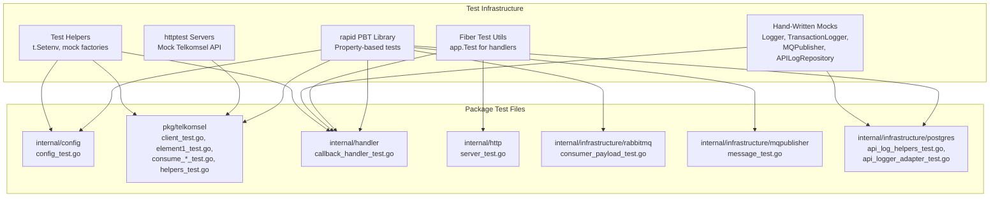

# Design Document: Unit Test Coverage

## Overview

This design establishes a comprehensive unit testing strategy for the pps-services-gateway-telkomsel Go service to achieve ≥90% code coverage across all packages. The service integrates with Telkomsel ESB Modern Channel APIs, RabbitMQ, and PostgreSQL — each requiring distinct test patterns.

The approach uses Go's standard `testing` package with table-driven tests, `net/http/httptest` for HTTP client testing, `gofiber/fiber/v2` test utilities for handler testing, and hand-written mocks for interface-based dependency injection. Property-based testing via `pgregory.net/rapid` validates universal invariants across generated inputs.

## Architecture



## Components and Interfaces

### Mock Interfaces

The following contract interfaces require hand-written mocks (no external mock generation tool needed given the small interface surface):

| Interface | Package | Methods to Mock |
|---|---|---|
| `contractsvc.Logger` | `internal/domain/contract/service` | `Info`, `Warn`, `Error` |
| `contractsvc.TransactionLogger` | `internal/domain/contract/service` | `GetTransactionByOurTrxID`, `InsertCallbackResponse`, `InsertTransaction`, `UpdateTransactionStatus`, `InsertSyncResponse`, `GetResponsesByMsgID`, `RunMigration`, `Close` |
| `contractsvc.MQPublisher` | `internal/domain/contract/service` | `Publish` |
| `contractsvc.APILogRepository` | `internal/domain/contract/service` | `Insert` |
| `telkomsel.APILogger` | `pkg/telkomsel` | `Log` |

Each mock captures call arguments and allows configurable return values for assertion in tests.

### Test Patterns by Package

| Package | Pattern | Key Technique |
|---|---|---|
| `internal/config` | Table-driven + `t.Setenv` | Env var isolation per subtest |
| `pkg/telkomsel` (client) | `httptest.NewServer` + table-driven | Mock HTTP responses, verify request construction |
| `pkg/telkomsel` (helpers) | Table-driven pure function tests | Direct input/output verification |
| `pkg/telkomsel` (consume wrappers) | `httptest` + `t.Setenv` | End-to-end wrapper validation |
| `internal/handler` | `fiber.App.Test()` + mock interfaces | HTTP request/response via fiber test |
| `internal/http` | `fiber.App.Test()` | Route registration and health check |
| `internal/infrastructure/rabbitmq` | Table-driven JSON unmarshaling | `consumePayload.UnmarshalJSON` |
| `internal/infrastructure/mqpublisher` | Table-driven + JSON marshal | `ProviderPublishMessage` construction |
| `internal/infrastructure/postgres` | Table-driven + mock interfaces | Helper functions and adapter mapping |

### Test File Structure

```
internal/
  config/
    config_test.go              # Load, LoadCallbackServer, LoadTelkomsel
  handler/
    callback_handler_test.go    # CallbackHandler.Handle with mock deps
    mock_test.go                # mockLogger, mockTransactionLogger, mockMQPublisher
  http/
    server_test.go              # Route registration, /health
  infrastructure/
    mqpublisher/
      message_test.go           # NewProviderPublishMessage, JSON serialization
    postgres/
      api_log_helpers_test.go   # nullIfEmpty, nullIfZero, toRawJSONB
      api_logger_adapter_test.go # APILoggerAdapter.Log with mock repo
      mock_test.go              # mockAPILogRepository, mockLogger
    rabbitmq/
      consumer_payload_test.go  # consumePayload.UnmarshalJSON, parseCommand
pkg/
  telkomsel/
    client_test.go              # NewClient, validators, API methods with httptest
    element1_test.go            # EncryptElement1, pkcs5Pad
    helpers_test.go             # normalizeMSISDN, deriveSequence, buildTelkomselTransactionID,
                                # generateSignature, sanitizeHeadersForLog, sanitizeJSONForLog,
                                # classifyError, isRetryableError
    consume_pulsa_test.go       # (existing) InitiateRegularRechargeOnConsume
    browse_offer_test.go        # (existing) BrowseOffer client tests
    browse_offer_consume_test.go # (existing) BrowseOfferOnConsume
    order_dealer_consume_test.go # OrderDealerOnConsume
    check_order_status_consume_test.go # CheckOrderStatusOnConsume
```

### Environment Variable Testing Strategy

All env-var-dependent tests use `t.Setenv()` (Go 1.17+) which automatically restores the original value when the test completes. For existing tests using the manual `setEnvForTest` helper, that pattern remains compatible.

Rules:
- Never use `t.Parallel()` in tests that call `t.Setenv()` — Go enforces this at runtime
- Each table-driven subtest sets its own env vars via `t.Setenv` in the subtest body
- Tests that don't touch env vars can safely use `t.Parallel()`

### Mock Implementation Pattern

```go
// Example: mockLogger for use across test packages
type mockLogger struct {
    infoCalls  [][]any
    warnCalls  [][]any
    errorCalls [][]any
}

func (m *mockLogger) Info(msg string, args ...any)  { m.infoCalls = append(m.infoCalls, append([]any{msg}, args...)) }
func (m *mockLogger) Warn(msg string, args ...any)  { m.warnCalls = append(m.warnCalls, append([]any{msg}, args...)) }
func (m *mockLogger) Error(msg string, args ...any) { m.errorCalls = append(m.errorCalls, append([]any{msg}, args...)) }
```

Mocks are defined in `mock_test.go` files within each package that needs them, keeping them co-located and unexported.

## Data Models

No new persistent data models are introduced. Test data models include:

- **Table-driven test case structs**: `struct { name string; input X; want Y; wantErr string }` pattern
- **Mock state structs**: Capture call arguments for assertion (e.g., `mockAPILogRepository.insertCalls`)
- **Test fixture JSON**: Inline JSON strings for httptest response bodies and consumePayload parsing

## Correctness Properties

*A property is a characteristic or behavior that should hold true across all valid executions of a system — essentially, a formal statement about what the system should do. Properties serve as the bridge between human-readable specifications and machine-verifiable correctness guarantees.*

### Property 1: Config loader env var mapping

*For any* set of valid, non-empty environment variable values, calling `Load` or `LoadTelkomsel` SHALL return a config struct whose fields exactly match the provided environment variable values.

**Validates: Requirements 1.1, 1.7**

### Property 2: LoadTelkomsel missing env var identification

*For any* single required Telkomsel environment variable that is unset (while all others are set), `LoadTelkomsel` SHALL return an error whose message contains the name of the missing variable.

**Validates: Requirements 1.8**

### Property 3: Config timeout parsing

*For any* positive integer timeout value set in the `TIMEOUT` environment variable, `LoadTelkomsel` SHALL return a `TelkomselConfig` with `Timeout` equal to that many seconds.

**Validates: Requirements 1.9**

### Property 4: Valid request validation acceptance

*For any* well-formed `InitiateRegularRechargeRequest`, `OrderDealerRequest`, `BrowseOfferRequest`, or `CheckOrderStatusRequest` (all required fields populated, service_id = 13 chars starting with "62", transaction_id ≤ 25 chars, stock_type ∈ {"FIXED","BULK"}), the corresponding validator SHALL return nil.

**Validates: Requirements 2.4, 2.8, 2.9, 2.10**

### Property 5: Invalid request field identification

*For any* request type and *any* single required field set to empty (while all other fields are valid), the corresponding validator SHALL return a non-nil error whose message contains the field name.

**Validates: Requirements 2.2, 2.5, 2.6, 2.7, 2.11**

### Property 6: EncryptElement1 produces valid base64 output

*For any* non-empty PIN string and *any* valid base64-encoded 16-byte key, `EncryptElement1` SHALL return a non-empty string that is valid base64 and a nil error.

**Validates: Requirements 4.1**

### Property 7: EncryptElement1 determinism

*For any* PIN and valid 16-byte base64 key, calling `EncryptElement1` twice with the same inputs SHALL produce identical ciphertext.

**Validates: Requirements 4.4**

### Property 8: Invalid encryption key rejection

*For any* base64 string that decodes to a byte slice of length ≠ 16, `EncryptElement1` SHALL return an error containing "must decode to 16 bytes".

**Validates: Requirements 4.2**

### Property 9: MSISDN normalization format invariant

*For any* valid MSISDN input (starting with "0", "+62", or "62") that results in exactly 13 digits after normalization, `normalizeMSISDN` SHALL return a 13-character string starting with "62".

**Validates: Requirements 5.1, 5.2, 5.3**

### Property 10: deriveSequence range invariant

*For any* string msgID (empty, numeric, or non-numeric), `deriveSequence` SHALL return a value in the range [0, 9999].

**Validates: Requirements 5.6, 5.7, 5.8**

### Property 11: buildTelkomselTransactionID structure invariant

*For any* organization code, timestamp, and sequence value, `buildTelkomselTransactionID` SHALL return a 25-character string composed of a 6-character org code prefix, a 15-character timestamp segment, and a 4-digit zero-padded sequence suffix.

**Validates: Requirements 5.9**

### Property 12: Non-success status code produces BusinessError

*For any* HTTP 200 response from the mock server containing a `status_code` value other than "00000", the Telkomsel client API methods SHALL return a `*BusinessError` with `Code` matching the response status code.

**Validates: Requirements 3.2**

### Property 13: Consume payload flexible field name parsing

*For any* valid consume payload data, encoding it as JSON with either snake_case or camelCase field names and unmarshaling via `consumePayload.UnmarshalJSON` SHALL produce the same parsed field values.

**Validates: Requirements 9.1, 9.2**

### Property 14: Pulsa command parsing extraction

*For any* positive integer nominal and valid stock type string, formatting them as `"{nominal}*{stockType}"` and parsing via `parseCommand` (with typeVoucher="pulsa") SHALL extract the original amount and stock_type.

**Validates: Requirements 9.3**

### Property 15: Paket data command parsing extraction

*For any* positive integer nominal, non-empty product ID, and valid stock type string, formatting them as `"{nominal}*{BID}*{stockType}"` and parsing via `parseCommand` (with typeVoucher="paket data") SHALL extract the original amount, product_id, and stock_type.

**Validates: Requirements 9.4**

### Property 16: Amount string-to-int parsing

*For any* non-negative integer, encoding it as a JSON string in the `amount` field and unmarshaling via `consumePayload.UnmarshalJSON` SHALL produce the original integer value in `Amount`.

**Validates: Requirements 9.5**

### Property 17: clientNumber MSISDN fallback

*For any* non-empty clientNumber string, when `msisdn` is empty in the JSON payload, `consumePayload.UnmarshalJSON` SHALL set `MSISDN` to the clientNumber value.

**Validates: Requirements 9.6**

### Property 18: ProviderPublishMessage serialization round-trip

*For any* valid `ProviderPublishData`, creating a `ProviderPublishMessage` via `NewProviderPublishMessage` and serializing to JSON SHALL produce output containing `"source":"PROVIDER"` and all data fields matching the input.

**Validates: Requirements 10.1, 10.2**

### Property 19: Null helper passthrough

*For any* non-empty string, `nullIfEmpty` SHALL return the string unchanged. *For any* non-zero integer, `nullIfZero` SHALL return the integer unchanged.

**Validates: Requirements 11.2, 11.4**

### Property 20: toRawJSONB valid JSON passthrough

*For any* valid JSON byte slice, `toRawJSONB` SHALL return the bytes unchanged.

**Validates: Requirements 11.5**

### Property 21: toRawJSONB invalid JSON wrapping

*For any* non-empty byte slice that is not valid JSON, `toRawJSONB` SHALL return a byte slice that is valid JSON (the original wrapped as a JSON string).

**Validates: Requirements 11.6**

### Property 22: generateSignature produces 32-char hex

*For any* non-empty API_KEY, SECRET_KEY, and timestamp strings, `generateSignature` SHALL return a 32-character hexadecimal string.

**Validates: Requirements 13.1**

### Property 23: sanitizeHeadersForLog masks sensitive keys

*For any* HTTP header map containing keys matching "api-key", "x-signature", or "authorization" (case-insensitive), `sanitizeHeadersForLog` SHALL return a map where those values are masked (not equal to the original).

**Validates: Requirements 13.3**

### Property 24: sanitizeJSONForLog redacts sensitive fields

*For any* JSON object containing `third_party_password` or `element1` fields, `sanitizeJSONForLog` SHALL return a string where those field values are replaced with `"***"`.

**Validates: Requirements 13.4**

### Property 25: Error classification correctness

*For any* `BusinessError`, `classifyError` SHALL return `("business", ...)`. *For any* non-nil, non-`BusinessError` error, `classifyError` SHALL return `("technical", ...)`. For nil, it SHALL return `("", "")`.

**Validates: Requirements 13.8, 13.9, 13.10**

### Property 26: Callback handler invalid parameter rejection

*For any* callback request where `organization_code` length is outside [6,13], or `service_id` length ≠ 13, or `status` is not "SUCCESS"/"FAILED", the `CallbackHandler` SHALL return HTTP 400.

**Validates: Requirements 7.3, 7.4, 7.5**

## Error Handling

### Test Error Patterns

- **Missing env vars**: Tests verify specific error messages containing the variable name. Use `strings.Contains(err.Error(), "VARIABLE_NAME")` assertions.
- **Validation errors**: Table-driven tests with `wantErr` field containing expected substring. Each invalid input case verifies the error identifies the problematic field.
- **HTTP errors**: `httptest` servers return configured status codes. Tests assert correct error type (`*BusinessError` vs `*TechnicalError`) via `errors.As`.
- **Mock failures**: Mocks return configurable errors. Tests verify the caller handles them gracefully (logs error, returns fallback, doesn't panic).
- **Retry behavior**: Tests count mock server invocations to verify retry count matches `maxRetries + 1` for retryable errors and exactly 1 for non-retryable errors.

### Test Isolation

- Each test function is self-contained with its own mocks and env var setup
- `t.Setenv` ensures automatic cleanup — no leaked state between tests
- `httptest.NewServer` instances are closed via `defer srv.Close()`
- Mock state is not shared between subtests

## Testing Strategy

### Dual Testing Approach

**Unit tests (example-based)**: Cover specific scenarios, edge cases, error conditions, and integration points between components. These form the bulk of the test suite and use table-driven patterns.

**Property-based tests**: Validate universal invariants across randomly generated inputs using `pgregory.net/rapid`. Each property test runs a minimum of 100 iterations and references its design document property.

### Property-Based Testing Configuration

- Library: `pgregory.net/rapid` (Go-native, no external dependencies beyond the module)
- Minimum iterations: 100 per property
- Tag format: `// Feature: unit-test-coverage, Property {N}: {title}`
- Each correctness property (1–26) maps to exactly one `rapid.Check` call

### Test Dependencies

| Dependency | Purpose |
|---|---|
| `testing` (stdlib) | Test framework |
| `net/http/httptest` (stdlib) | Mock HTTP servers for Telkomsel API |
| `github.com/gofiber/fiber/v2` | `app.Test()` for handler/server tests |
| `pgregory.net/rapid` | Property-based testing library |

### Coverage Measurement

```bash
# Run all tests with coverage
go test ./... -coverprofile=coverage.out -count=1

# View per-package coverage
go tool cover -func=coverage.out

# Generate HTML report
go tool cover -html=coverage.out -o coverage.html
```

Target: ≥90% statement coverage per package. Packages with heavy external I/O (e.g., `postgres` database operations, `mqpublisher.Publish` with real AMQP) are tested at the helper/adapter layer; the actual I/O methods are excluded from the 90% target where they require live infrastructure.

### What Is NOT Tested

- `cmd/app/main.go` — application wiring, tested via integration/smoke tests
- `PostgresTransactionLogger` methods that require a live database connection (e.g., `InsertTransaction`, `RunMigration`)
- `AMQPPublisher.Publish` — requires live RabbitMQ; the message construction is tested
- `ConsumerServiceImpl.Start` / `consumeSession` — requires live RabbitMQ connection; payload parsing and helper functions are tested
