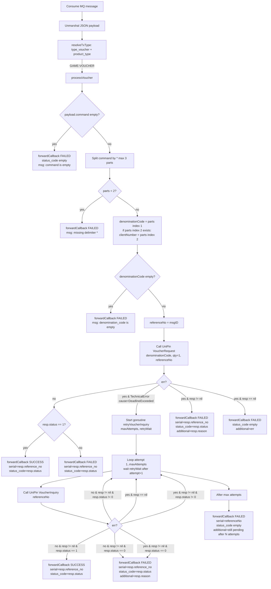

# Flowchart UniPin Gateway

Dokumen ini merangkum alur proses utama di gateway UniPin untuk:
- Voucher (GAME-VOUCHER)
- Game Direct Top Up (GAME-DIRECT-TOP-UP)

> Catatan: diagram di bawah mengikuti alur implementasi consumer (RabbitMQ) di gateway UniPin.

## Voucher — GAME-VOUCHER



### Retry Voucher Inquiry (jika VoucherRequest timeout)

1) Gateway membaca **max retry** dari env `RETRY_MAX_ATTEMPTS` (contoh: 1, 2, 3).
2) Gateway membaca **delay retry** (detik) dari env `RETRY_WAIT_SECONDS` (contoh: 10, 5, 3).
3) `RETRY_MAX_ATTEMPTS` dan `RETRY_WAIT_SECONDS` dipakai untuk membuat goroutine `retryVoucherInquiry()`:
   - hit UniPin `VoucherInquiry(reference_no)` sebanyak `maxAttempts`
   - jeda antar retry = `retryWait` (mulai attempt ke-2)
4) Retry ini **hanya ter-trigger** ketika UniPin `VoucherRequest` error timeout (TechnicalError dengan `cause=DeadlineExceeded`).
5) Timeout untuk call `VoucherRequest` dikontrol oleh env `VOUCHER_REQUEST_TIMEOUT` (detik) dan default = **60s**.

### Flow detail (setelah consume)

Urutan proses setelah consumer menerima message (GAME-DIRECT-TOP-UP):

1) **Parse command**
  - Format baru: `game_code*denomination_id*{fields_json}`.
  - Backward-compatible: jika segmen ke-3 tidak terlihat seperti JSON object, fields akan diambil dari `payload.MSISDN`.
  - Jika `command`, `game_code`, `denomination_id`, atau `fields` kosong/invalid → publish `FAILED` (statusToBe = `C`).

2) **ValidateUser**
  - Call UniPin `ValidateUser(game_code, fields)`.
  - Jika error dan ada `validateResp` → publish `FAILED` dengan:
    - `status_code` = status UniPin (atau `error.error_code` jika `status=0` dan tersedia)
    - `additionalMessage` = reason UniPin (pakai `error.message` bila `reason` kosong)
  - Jika error dan `validateResp` nil → publish `FAILED` dengan `additionalMessage = err.Error()`.

3) **CreateOrder**
  - Call UniPin `CreateOrder(game_code, validation_token, reference_no=msgID, denomination_id)`.
  - Timeout untuk call `CreateOrder` dikontrol oleh env `ORDER_REQUEST_TIMEOUT` (detik) dan default = **60s**.
  - Jika timeout (TechnicalError dengan `cause=DeadlineExceeded`) → lanjut ke **OrderInquiry** (fallback) memakai `reference_no = msgID`.
  - Jika error dan ada `orderResp`:
    - Jika `orderResp.status == 0` → publish `FAILED` (final) menggunakan `orderResp.reference_no`.
    - Jika `orderResp.status != 0` → lanjut ke **OrderInquiry** dengan `reference_no = orderResp.reference_no` (fallback ke `msgID` jika kosong).
  - Jika sukses → publish `SUCCESS` (statusToBe = `F`).

4) **OrderInquiry + retry (polling status)**
  - Call UniPin `OrderInquiry(reference_no)`.
  - Jika sukses → publish `SUCCESS`.
  - Jika error dan ada `inquiryResp`:
    - Jika `inquiryResp.status == 0` → publish `FAILED`.
    - Selain itu dianggap **pending** → publish `PROCESSING` (statusToBe = `S`) lalu start goroutine `retryOrderInquiry()`.

5) **retryOrderInquiry()**
  - Loop attempt `1..RetryMaxAttempts` dengan jeda `RetryWait` antar attempt (mulai attempt ke-2).
  - Jika inquiry jadi sukses → publish `SUCCESS`.
  - Jika `status == 0` → publish `FAILED`.
  - Jika masih pending sampai max attempt → publish `FAILED` dengan additionalMessage “still pending after N attempts”.

Catatan:
- `status_code` yang dipublish ke downstream diisi dari `resp.status`. Untuk `status=0`, gateway memprioritaskan `resp.error.error_code` (atau `resp.error.code`) bila tersedia.
- Nilai retry menggunakan konfigurasi consumer (`RetryMaxAttempts` & `RetryWait`).

## Game Direct Top Up — GAME-DIRECT-TOP-UP

```mermaid
flowchart TD
  A[Consume MQ message] --> B[Unmarshal JSON payload]
  B --> C[resolveTxType: type_voucher + product_type]
  C -->|GAME-DIRECT-TOP-UP| G0[processGame]

  G0 --> G1{payload.command empty?}
  G1 -->|yes| GFail1[forwardCallback FAILED<br/>msg: command is empty]
  G1 -->|no| G2[Split command by * max 3 parts]

  G2 --> G3{parts < 2?}
  G3 -->|yes| GFail2[forwardCallback FAILED<br/>msg: missing delimiter *]
  G3 -->|no| G4[gameCode=parts index 0<br/>denominationID=parts index 1]

  G4 --> G5{gameCode empty?}
  G5 -->|yes| GFail3[forwardCallback FAILED<br/>msg: game_code is empty]
  G5 -->|no| G6{denominationID empty?}
  G6 -->|yes| GFail4[forwardCallback FAILED<br/>msg: denomination_id is empty]

  G6 -->|no| G7[fieldsJSON: if parts index 2 looks like JSON object use it<br/>else fallback legacy payload.MSISDN]
  G7 --> G8{fieldsJSON empty?}
  G8 -->|yes| GFail5[forwardCallback FAILED<br/>msg: fields is empty]
  G8 -->|no| G9[parseJSONMap(fieldsJSON)]

  G9 --> G10{parse error OR fields empty?}
  G10 -->|yes| GFail6[forwardCallback FAILED<br/>msg: fields invalid/empty]
  G10 -->|no| G11[Call UniPin ValidateUser<br/>gameCode, fields]

  G11 --> G12{err?}
  G12 -->|yes & validateResp != nil| GFail7[forwardCallback FAILED<br/>status_code=validateResp.status<br/>additional=validateResp.reason]
  G12 -->|yes & validateResp == nil| GFail8[forwardCallback FAILED<br/>status_code empty<br/>additional=err]

  G12 -->|no| G13[Call UniPin CreateOrder<br/>gameCode, validationToken<br/>referenceNo=msgID, denominationID]
  G13 --> G14{err?}

  G14 -->|no| GOk[forwardCallback SUCCESS<br/>serial=orderResp.reference_no<br/>status_code=orderResp.status]

  G14 -->|yes & TechnicalError cause=DeadlineExceeded| G15[processOrderInquiry<br/>referenceNo=msgID]
  G14 -->|yes & orderResp != nil & orderResp.status == 0| GFail9[forwardCallback FAILED<br/>serial=orderResp.reference_no<br/>status_code=orderResp.status<br/>additional=orderResp.reason]
  G14 -->|yes & orderResp != nil & orderResp.status != 0| G16[processOrderInquiry<br/>referenceNo=orderResp.reference_no or msgID]
  G14 -->|yes & orderResp == nil| GFail10[forwardCallback FAILED<br/>status_code empty<br/>additional=err]

  G15 --> GI0
  G16 --> GI0

  GI0[Call UniPin OrderInquiry<br/>referenceNo] --> GI1{err?}
  GI1 -->|no| GIS[forwardCallback SUCCESS<br/>serial=inquiryResp.reference_no<br/>status_code=inquiryResp.status]

  GI1 -->|yes & inquiryResp == nil| GIFail1[forwardCallback FAILED<br/>serial=referenceNo<br/>status_code empty<br/>additional=err]
  GI1 -->|yes & inquiryResp != nil & inquiryResp.status == 0| GIFail2[forwardCallback FAILED<br/>serial=inquiryResp.reference_no<br/>status_code=inquiryResp.status]
  GI1 -->|yes & inquiryResp != nil & inquiryResp.status != 0| GIPend[forwardCallback PROCESSING<br/>serial=inquiryResp.reference_no<br/>status_code=inquiryResp.status]

  GIPend --> GR0[Start goroutine retryOrderInquiry<br/>maxAttempts, retryWait]
  GR0 --> GR1[Loop attempt 1..maxAttempts<br/>wait retryWait after attempt>1]
  GR1 --> GR2[Call UniPin OrderInquiry<br/>referenceNo]

  GR2 --> GR3{err?}
  GR3 -->|no & resp != nil| GRDone[forwardCallback SUCCESS<br/>serial=resp.reference_no<br/>status_code=resp.status]
  GR3 -->|yes & resp == nil| GR1
  GR3 -->|yes & resp != nil & resp.status == 0| GRFail[forwardCallback FAILED<br/>serial=resp.reference_no<br/>status_code=resp.status]
  GR3 -->|yes & resp != nil & resp.status != 0| GR1

  GR1 --> GRMax[After max attempts]
  GRMax --> GRFail2[forwardCallback FAILED<br/>serial=serialNumber<br/>status_code empty<br/>additional=still pending after N attempts]
```

